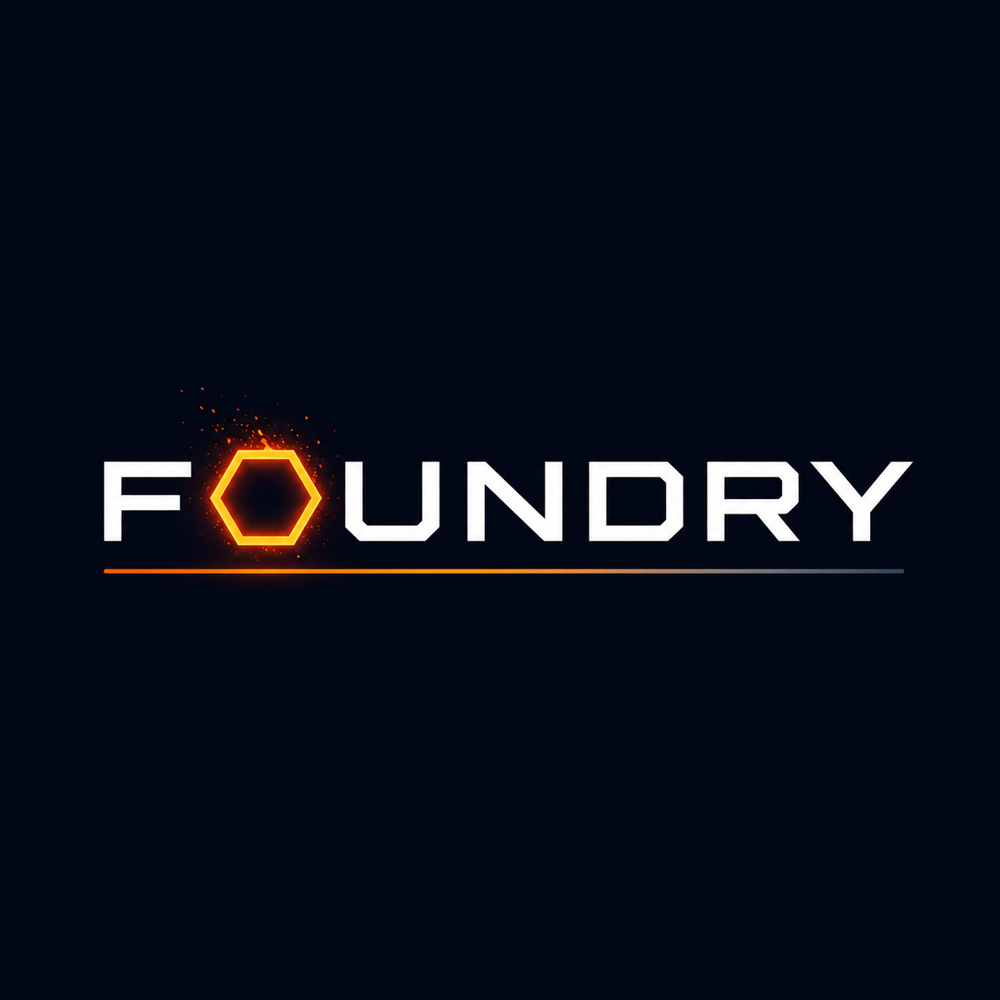
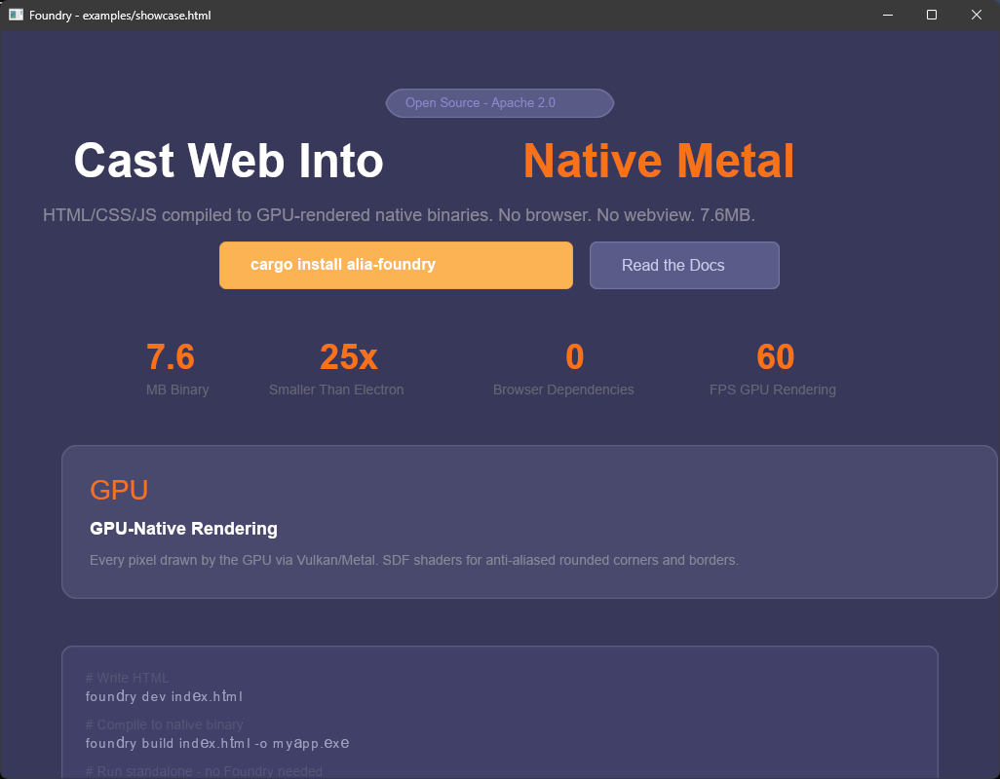
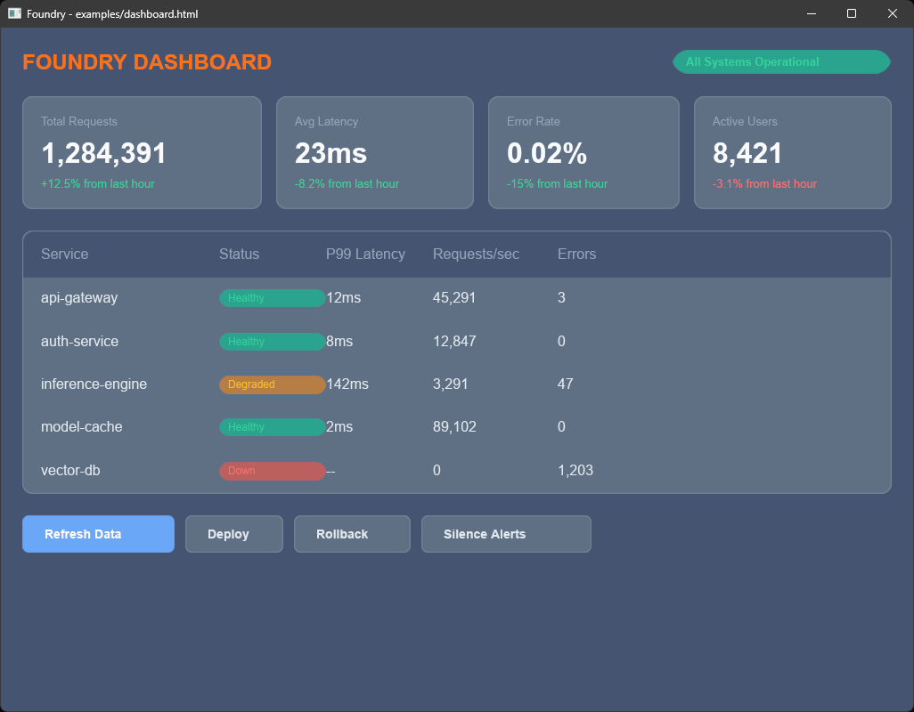

<p align="center">
  
  <br><br>
  <b>Cast web into native metal.</b>
  <p align="center">
    <a href="https://crates.io/crates/alia-foundry"></a>
    <a href="https://github.com/TxsharDev/Foundry/blob/master/LICENSE"></a>
    <a href="#"></a>
    <a href="#"></a>
  </p>
  <p align="center">
    <a href="docs/wiki/Quick-Start.md">Quick Start</a> &nbsp;|&nbsp;
    <a href="docs/wiki/How-It-Works.md">How It Works</a> &nbsp;|&nbsp;
    <a href="docs/wiki/CSS-Reference.md">CSS Reference</a> &nbsp;|&nbsp;
    <a href="docs/wiki/Limitations.md">Limitations</a> &nbsp;|&nbsp;
    <a href="docs/wiki/Architecture.md">Architecture</a>
  </p>
</p>

---

Electron ships a 200MB Chromium to run a chat app. Your "native" app is a web browser pretending to be software.

Foundry compiles HTML, CSS, and JavaScript into a GPU-rendered native binary. No browser engine. No webview. 7.6MB.

```bash
foundry build index.html -o app.exe   # compile to standalone native binary
foundry dev index.html                # live preview + hot reload
```

Write HTML. Get a native app. That's it.

<p align="center">
  
  <br>
  <em>Landing page with animations -- compiled from HTML to native GPU binary</em>
</p>

<p align="center">
  
  <br>
  <em>117-node monitoring dashboard -- GPU-rendered, no browser</em>
</p>

## What Ships

- **Binary compilation** -- `foundry build` produces a standalone .exe from HTML/CSS/JS
- **GPU rendering** -- every pixel drawn by wgpu (Vulkan/Metal) via SDF shaders
- **CSS animations** -- `@keyframes`, `animation`, `transition`, `:hover` pseudo-class
- **Compound selectors** -- `.card h1`, `div.btn`, `.card.active` all work correctly
- **Hot reload** -- edit your files, the window updates live
- **External files** -- `<link>` stylesheets and `<script src>` resolved at compile time
- **Embedded JS** -- event handlers, DOM mutations via boa (pure-Rust JS engine)
- **Flexbox layout** -- powered by taffy (from Dioxus/Bevy)
- **55 tests**, 3,883 lines of Rust, 4 demo apps

## Quick Start

```bash
cargo install alia-foundry
```

Create `hello.html`:

```html
<!DOCTYPE html>
<html>
<head>
    <style>
        @keyframes fadeIn {
            from { opacity: 0 }
            to { opacity: 1 }
        }
        body {
            display: flex;
            justify-content: center;
            align-items: center;
            height: 100vh;
            background-color: #1a1a2e;
        }
        .card {
            background-color: #16213e;
            padding: 40px;
            border-radius: 12px;
            display: flex;
            flex-direction: column;
            align-items: center;
            gap: 20px;
            animation: fadeIn 1s;
        }
        h1 { color: #e94560; }
        .btn {
            background-color: #e94560;
            color: white;
            padding: 12px 32px;
            border-radius: 8px;
            transition: all 0.2s;
        }
        .btn:hover {
            background-color: #c73650;
        }
    </style>
</head>
<body>
    <div class="card">
        <h1>Counter</h1>
        <div id="count" style="font-size: 64px; color: white">0</div>
        <div class="btn" onclick="increment()">+</div>
    </div>
    <script>
        var count = 0;
        function increment() {
            count = count + 1;
            document.getElementById("count").setTextContent(String(count));
        }
    </script>
</body>
</html>
```

Run it:
```bash
foundry dev hello.html        # live preview with hot reload
foundry build hello.html -o hello.exe  # compile to native binary
./hello.exe                   # runs standalone, no Foundry needed
```

## Foundry vs. Electron

| | Foundry | Electron |
|---|---|---|
| Binary size | **7.6 MB** | 200+ MB |
| Runtime | None (standalone) | Chromium |
| Rendering | GPU (wgpu/Vulkan) | Chromium/Skia |
| JS engine | boa (embedded) | V8 |
| CSS animations | Yes (@keyframes, transitions) | Yes (full) |
| Web API coverage | Subset | Full |
| Startup | Fast (GPU init + first frame) | 1-3 seconds |

Honest caveat: Electron runs full web applications. Foundry runs a useful subset. The comparison is binary size and rendering architecture, not feature parity.

## How It Works

1. **Parse** HTML into a scene graph via html5ever (single pass: styles, scripts, elements extracted together)
2. **Resolve** CSS cascade, specificity, inheritance, `:hover`, and `@keyframes` at load time
3. **Layout** via taffy (flexbox) with parent font-size inheritance for text nodes
4. **Render** with wgpu via SDF fragment shader (rounded corners, borders, anti-aliasing in one draw call)
5. **Text** via glyphon/cosmic-text with system font discovery
6. **Animate** transitions and keyframe animations per-frame with style interpolation
7. **Execute** JS event handlers via boa with DOM mutation bridge
8. **Build** embeds HTML into a generated Rust project and compiles to standalone binary

## Supported CSS

**Layout:** display (flex/block/inline/none), flex-direction, justify-content, align-items, flex-wrap, gap, flex-grow, flex-shrink

**Box model:** margin, padding, width, height, min/max-width/height, border, border-radius

**Visual:** background-color, color, opacity, border-color, z-index

**Text:** font-size, font-weight, font-family, text-align, line-height

**Position:** relative, absolute, fixed, top/left/right/bottom

**Units:** px, %, em, rem, vh, vw

**Pseudo-classes:** :hover (with style swapping and relayout)

**Animations:** @keyframes, animation (name, duration, delay, iteration-count, direction), transition (all properties, duration)

**Overflow:** visible, hidden, scroll

**Selectors:** tag, .class, #id, *, compound (div.btn, .card.active), descendant (.card h1, #main .text)

## Supported JS

```javascript
var el = document.getElementById("myId");
el.setTextContent("new text");
el.setStyle("background-color", "#ff0000");
el.addClass("active");
el.removeClass("hidden");
console.log("debug output");
```

Events: `onclick`, `onmouseenter`, `onmouseleave`

## Architecture

```
src/
  lib.rs       Runtime library (used by compiled binaries)
  main.rs      CLI: dev (live preview) and build (compile to binary)
  scene.rs     Scene graph, styles, layout rects, animation state, lerp
  html.rs      Single-pass HTML parser (html5ever -> scene + styles + scripts)
  css.rs       CSS parser, compound selectors, @keyframes, cascade resolver
  layout.rs    taffy-backed flexbox layout with font-aware text measurement
  render.rs    wgpu GPU renderer: SDF quads, dynamic clear color
  text.rs      glyphon GPU text rendering with system fonts
  events.rs    Hit testing, hover styles, event bubbling, scroll
  js.rs        boa JS engine with DOM mutation bridge
```

## Examples

| Example | Nodes | Features |
|---------|-------|----------|
| `counter.html` | 14 | Click events, hover effects, JS state |
| `todo.html` | 32 | Task list, status tracking |
| `dashboard.html` | 117 | Stats cards, service table, action buttons, hover transitions |
| `showcase.html` | 78 | Animated landing page, @keyframes fadeIn/pulse, feature cards |

## What This Does NOT Do

- **Full CSS.** No grid, no media queries, no calc(), no custom properties, no pseudo-elements.
- **Accessibility.** GPU rendering produces pixels, not accessible UI trees.
- **Full web platform.** No fetch, no WebSocket, no localStorage, no Promise/async.
- **Fast JS.** boa is 10-100x slower than V8 for computation.
- **Image rendering.** Not yet (planned).

Foundry is for: dashboards, kiosk UIs, embedded displays, internal tools, game overlays -- apps where you want web-like development without the 200MB browser tax.

## Roadmap

**v0.1** (current) -- Full pipeline: HTML/CSS/JS to GPU window and standalone binary. SDF rendering, flexbox, animations, transitions, :hover, compound selectors, hot reload, embedded JS. 55 tests. 7.6MB binary.

**v0.2** -- Image rendering (GPU textures), CSS grid, font embedding, text input with cursor.

**v0.3** -- Basic accessibility (UI Automation on Windows), multi-window, clipboard integration.

## Prior Art

| Tool | What It Does | How Foundry Differs |
|------|-------------|-------------------|
| **Electron** | Ships Chromium as the renderer | Foundry has no browser engine, renders directly on GPU |
| **Tauri** | Uses the system webview | Still a browser engine (WebKit/WebView2). Foundry is GPU-native. |
| **Flutter** | Custom renderer, Dart language | Not web technologies. Foundry uses HTML/CSS/JS. |
| **Sciter** | Lightweight HTML/CSS engine | Proprietary, C++, not GPU-accelerated |
| **Servo** | Research browser engine in Rust | Full browser. Foundry uses Servo's parsing crates with a custom GPU renderer. |

## License

Apache-2.0 | ALIA Labs

Built by [Tushar Sharma](https://github.com/TxsharDev) at ALIA Labs.
